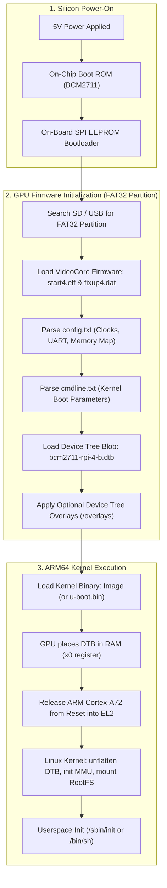

# Raspberry Pi 4: Boot Architecture & Hardware Setup

> **Target Silicon:** Broadcom BCM2711 (Quad-Core ARM Cortex-A72 @ 1.5GHz / AArch64)
> **Target Board:** Raspberry Pi 4 Model B

---

## 1. Architectural Overview & Boot Pipeline

Before touching the SD card or terminal, understand the unique multi-stage boot sequence of the Raspberry Pi 4. Unlike standard x86 systems (BIOS/UEFI) or traditional ARM SoCs (SPL → U-Boot), **the Raspberry Pi is GPU-first silicon**: the VideoCore VI GPU initializes the hardware before releasing the ARM Cortex-A72 cores.

### Critical RPi 4 Hardware Distinctions
* **No `bootcode.bin` on SD card:** On the Raspberry Pi 3, `bootcode.bin` lived on the SD card. On Raspberry Pi 4, this stage is replaced by an **on-board 512KB SPI EEPROM** chip.
* **Firmware naming:** Pi 4 firmware binaries have a `4` suffix (`start4.elf`, `fixup4.dat`), unlike older Pis (`start.elf`, `fixup.dat`).
* **UART Logic:** The BCM2711 GPIO header operates at **3.3V LVCMOS**. Connecting a 5V serial adapter will permanently damage the SoC.

---

## 2. Hardware Bill of Materials & Serial Console Hookup

### 2.1 Required Equipment
1. **Raspberry Pi 4 Model B** (2GB, 4GB, or 8GB).
2. **USB-to-3.3V-TTL UART Cable** (Silicon Labs CP2102, FTDI FT232R, or Prolific PL2303).
3. **MicroSD Card** (16GB or 32GB Class 10 / UHS-1 recommended) + USB SD Card Reader.
4. **5V / 3A USB-C Power Supply** (Official Raspberry Pi PSU recommended).
5. **Host Machine or Docker Environment** (Ubuntu 22.04 LTS native or the monorepo Docker container: `./lab docker`).

### 2.2 Serial Debug Cable Pinout (115200 Baud, 8N1)
The primary serial console (`ttyS0` / miniUART or `ttyAMA0` / PL011) routes to pins 6, 8, and 10 on the 40-pin GPIO header:

| Header Pin # | BCM Pin Name | Function | Wire Color (Standard) | Connect to USB-TTL Cable |
| :--- | :--- | :--- | :--- | :--- |
| **Pin 6** | `GND` | Ground | Black | **GND** |
| **Pin 8** | `GPIO 14` | TXD (Pi Output) | White / Green | **RXD** (Adapter Input) |
| **Pin 10** | `GPIO 15` | RXD (Pi Input) | Green / White | **TXD** (Adapter Output) |

> [!CAUTION]
> **DO NOT CONNECT THE RED (VCC / 5V / 3.3V) PIN!**
> Power the Raspberry Pi exclusively through its USB-C port. Connecting the serial cable's power wire can cause ground loops, back-powering, or brownout resets.

---

**Next:** [SD Card Setup](sd_card_setup.md)
