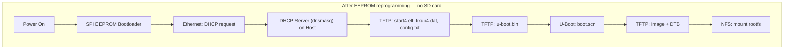

# Raspberry Pi 4: Eliminating the SD Card — Full Network Boot via EEPROM

The RPi4 SPI EEPROM bootloader (not the SD card) is the true first stage. It can be **reprogrammed to boot over the network (PXE/TFTP)** without any SD card at all. After a one-time EEPROM update, the Pi contacts a DHCP+TFTP server on power-on and downloads the entire boot chain.



> [!NOTE]
> Standard Raspberry Pi 4 Model B does **not** have built-in eMMC (that is the Compute Module 4). The EEPROM only stores the boot *configuration*, not the firmware. Firmware (`start4.elf`) must still be served — but via TFTP from the host instead of from SD.

---

## 1. One-Time EEPROM Reprogramming (Requires SD Card Once)

This step needs a running RPi OS on an SD card (or a USB drive). Do it once, then discard the card.

### Step 1 — Boot an Official RPi OS Image
Flash the latest **Raspberry Pi OS Lite (64-bit)** with [Raspberry Pi Imager](https://www.raspberrypi.com/software/) to a microSD card and boot it. This gives you access to `rpi-eeprom-config`.

### Step 2 — Check Current EEPROM Bootloader Version
```bash
sudo rpi-eeprom-update
```

### Step 3 — Extract and Edit EEPROM Config
```bash
# Dump the current EEPROM config to a file
sudo rpi-eeprom-config --out /tmp/boot.conf
```

The critical field is `BOOT_ORDER`. Update `/tmp/boot.conf`:
```ini
[all]
BOOT_UART=1

# Boot order: try network first (0x2), then USB (0x4), then SD (0x1) as fallback
# Digits are tried right-to-left
BOOT_ORDER=0xf241

# Timeout before moving to next boot mode (100ms units)
BOOT_ORDER_TIMEOUT=5

# Allow Network boot without SD/USB present
NETWORK_INSTALL_ENABLED=1
```

`BOOT_ORDER` digit meanings:

| Digit | Mode |
|:---:|:---|
| `0x1` | SD card |
| `0x2` | Network (PXE/TFTP) |
| `0x4` | USB mass storage |
| `0xf` | Restart from first mode |

### Step 4 — Flash the New Config
```bash
sudo rpi-eeprom-config --apply /tmp/boot.conf

# Verify
sudo rpi-eeprom-config
```

Reboot and remove the SD card — the Pi will now attempt network boot on next power-on.

---

## 2. Host DHCP + TFTP Server Setup (dnsmasq)

The Pi's EEPROM sends a DHCP broadcast over Ethernet. The host must answer with an IP and a TFTP server path pointing to the firmware files.

### Install dnsmasq
```bash
# Ubuntu / Debian
sudo apt install -y dnsmasq
```

### Configure `/etc/dnsmasq.conf`

Replace or append (adjust interface and IP range for your network):
```ini
# ================================================================
# dnsmasq — DHCP + TFTP for RPi4 network boot (no SD card)
# ================================================================

# Listen only on the LAN interface connected to the Pi
interface=enp2s0           # <-- change to your host's LAN interface
bind-interfaces

# DHCP range — hand out one IP (or a range) to the Pi
dhcp-range=192.168.1.150,192.168.1.160,255.255.255.0,12h

# Assign a predictable IP to the Pi by MAC (recommended)
# dhcp-host=dc:a6:32:xx:xx:xx,rpi4,192.168.1.150

# TFTP server root — all firmware files go here
enable-tftp
tftp-root=/srv/tftp/rpi4

# PXE boot file for RPi4 (EEPROM fetches this first)
dhcp-boot=start4.elf

# Log DHCP and TFTP activity
log-dhcp
log-queries
```

### Create TFTP Root and Populate Firmware
```bash
ROOT=/srv/tftp/rpi4
sudo mkdir -p ${ROOT}

# Copy RPi firmware (from shared/bsp/rpi4/ in the monorepo)
REPO=/path/to/arm-embedded-linux-lab   # <-- adjust to your local clone

sudo cp ${REPO}/shared/bsp/rpi4/start4.elf   ${ROOT}/
sudo cp ${REPO}/shared/bsp/rpi4/fixup4.dat   ${ROOT}/
sudo cp ${REPO}/shared/bsp/rpi4/config.txt   ${ROOT}/
sudo cp ${REPO}/shared/bsp/rpi4/u-boot.bin   ${ROOT}/
sudo cp ${REPO}/shared/bsp/rpi4/boot.scr     ${ROOT}/
```

Kernel and DTB are still served by the Docker TFTP server (port 69) during U-Boot's `boot.scr`. If you want everything from one server, also copy these to `${ROOT}` and point U-Boot's `serverip` to the host.

### Restart dnsmasq
```bash
sudo systemctl restart dnsmasq
sudo systemctl status  dnsmasq
```

> [!WARNING]
> If your host already runs a DHCP server (e.g., NetworkManager), dnsmasq will conflict on port 67. Either: (a) disable the existing DHCP server for the Pi-facing interface, or (b) run dnsmasq only on the Pi-facing interface with `bind-interfaces`.

---

## 3. Network Topology

```
┌─────────────────────────────────────────────────────┐
│  Host Workstation (192.168.1.220)                   │
│                                                     │
│  ┌──────────────┐  ┌──────────────┐  ┌──────────┐  │
│  │ dnsmasq      │  │ Docker TFTP  │  │ NFS      │  │
│  │ DHCP + TFTP  │  │ (port 69)    │  │ Server   │  │
│  │ /srv/tftp/   │  │ /workspace/  │  │ /srv/nfs/│  │
│  │   rpi4/      │  │   tftp/      │  │   rpi4-  │  │
│  └──────┬───────┘  └──────┬───────┘  │   rootfs │  │
│         │                 │          └────┬─────┘  │
└─────────┼─────────────────┼───────────────┼────────┘
          │    Gigabit Ethernet (enp2s0)     │
          └─────────────────┬───────────────┘
                            │
               ┌────────────▼──────────┐
               │  Raspberry Pi 4       │
               │  192.168.1.150        │
               │  (no SD card)         │
               └───────────────────────┘
```

---

## 4. Verifying Network Boot

Watch dnsmasq logs while powering on the Pi:
```bash
sudo journalctl -fu dnsmasq
```

Expected sequence:
```text
dnsmasq-dhcp: DHCPDISCOVER(enp2s0) dc:a6:32:xx:xx:xx
dnsmasq-dhcp: DHCPOFFER(enp2s0)    192.168.1.150 dc:a6:32:xx:xx:xx
dnsmasq-tftp: sent /srv/tftp/rpi4/start4.elf
dnsmasq-tftp: sent /srv/tftp/rpi4/fixup4.dat
dnsmasq-tftp: sent /srv/tftp/rpi4/config.txt
dnsmasq-tftp: sent /srv/tftp/rpi4/u-boot.bin
dnsmasq-tftp: sent /srv/tftp/rpi4/boot.scr
```

Then U-Boot fetches `Image` and `bcm2711-rpi-4-b.dtb` via TFTP (Docker TFTP server), and the kernel mounts the NFS rootfs.

---

## 5. Troubleshooting

### Issue 1: EEPROM Netboot — Pi Gets IP but TFTP Fails
* Confirm `start4.elf` is in the TFTP root (`/srv/tftp/rpi4/`).
* Check dnsmasq logs: `sudo journalctl -fu dnsmasq`.
* Port 69 (TFTP UDP) must not be blocked by firewall: `sudo ufw allow 69/udp`.
* Ensure dnsmasq is bound to the correct interface (`interface=enp2s0`).

### Issue 2: EEPROM Netboot — Pi Does Not Send DHCP Request
* EEPROM boot order did not take effect. Re-verify with `sudo rpi-eeprom-config`.
* Make sure Ethernet cable is connected **before** powering on (EEPROM checks link state).
* Try `BOOT_ORDER=0xf2` (network-only, no fallback) to force network-only mode and see UART output.

---

**Previous:** [U-Boot, TFTP & NFS Boot](uboot_tftp_boot.md)
