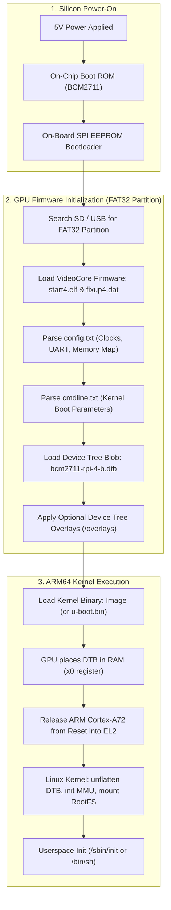
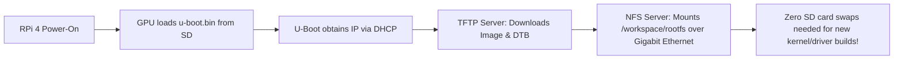

# Raspberry Pi 4: Manual Step-by-Step Linux Bringup Guide

> **Authoritative Platform Engineering Reference**  
> **Target Silicon:** Broadcom BCM2711 (Quad-Core ARM Cortex-A72 @ 1.5GHz / AArch64)  
> **Target Board:** Raspberry Pi 4 Model B  

---

## 1. Architectural Overview & Boot Pipeline

Before touching the SD card or terminal, understand the unique multi-stage boot sequence of the Raspberry Pi 4. Unlike standard x86 systems (BIOS/UEFI) or traditional ARM SoCs (SPL $\rightarrow$ U-Boot), **the Raspberry Pi is GPU-first silicon**: the VideoCore VI GPU initializes the hardware before releasing the ARM Cortex-A72 cores.



### Critical RPi 4 Hardware Distinctions
* **No `bootcode.bin` on SD card:** On the Raspberry Pi 3, `bootcode.bin` lived on the SD card. On Raspberry Pi 4, this stage is replaced by an **on-board 512KB SPI EEPROM** chip.
* **Firmware naming:** Pi 4 firmware binaries have a `4` suffix (`start4.elf`, `fixup4.dat`), unlike older Pis (`start.elf`, `fixup.dat`).
* **UART Logic:** The BCM2711 GPIO header operates at **3.3V LVCMOS**. Connecting a 5V serial adapter will permanently damage the SoC.

---

## 2. Hardware Bill of Materials & Serial Console Hookup

### 2.1 Required Equipment
1. **Raspberry Pi 4 Model B** (2GB, 4GB, or 8GB).
2. **USB-to-3.3V-TTL UART Cable** (Silicon Labs CP2102, FTDI FT232R, or Prolific PL2303).
3. **MicroSD Card** (16GB or 32GB Class 10 / UHS-1 recommended) + USB SD Card Reader.
4. **5V / 3A USB-C Power Supply** (Official Raspberry Pi PSU recommended).
5. **Host Machine or Docker Environment** (Ubuntu 22.04 LTS native or the monorepo Docker container: `./tools/docker/run.sh run`).

### 2.2 Serial Debug Cable Pinout (115200 Baud, 8N1)
The primary serial console (`ttyS0` / miniUART or `ttyAMA0` / PL011) routes to pins 6, 8, and 10 on the 40-pin GPIO header:

| Header Pin # | BCM Pin Name | Function | Wire Color (Standard) | Connect to USB-TTL Cable |
| :--- | :--- | :--- | :--- | :--- |
| **Pin 6** | `GND` | Ground | Black | **GND** |
| **Pin 8** | `GPIO 14` | TXD (Pi Output) | White / Green | **RXD** (Adapter Input) |
| **Pin 10** | `GPIO 15` | RXD (Pi Input) | Green / White | **TXD** (Adapter Output) |

> [!CAUTION]
> **DO NOT CONNECT THE RED (VCC / 5V / 3.3V) PIN!**  
> Power the Raspberry Pi exclusively through its USB-C port. Connecting the serial cable's power wire can cause ground loops, back-powering, or brownout resets.

---

## 3. SD Card Partitioning & Formatting

The Raspberry Pi bootloader requires a specific partition topology:
* **Partition 1 (`BOOT`):** FAT32 (Type `c` or `0x0c` W95 FAT32 LBA), minimum 256MB.
* **Partition 2 (`ROOTFS`):** ext4 (Linux native), taking up the remaining capacity.

### Step 3.1 Identify Your SD Card Device
Insert your SD card into your Linux host / workstation:
```bash
lsblk
# Identify your SD card device node carefully!
# Common nodes: /dev/sdb, /dev/sdc (USB reader) or /dev/mmcblk0 (internal reader)
```
> [!WARNING]
> Ensure you select the correct block device (referred to as `/dev/sdX` below). Writing to the wrong disk will destroy your host data.

### Step 3.2 Partition the Card
```bash
# Wipe previous partition table signatures
sudo wipefs -a /dev/sdX

# Partition with fdisk
sudo fdisk /dev/sdX
```
Inside `fdisk`, enter the following commands:
1. `o` $\rightarrow$ create a new empty DOS partition table.
2. `n` $\rightarrow$ new partition $\rightarrow$ `p` (primary) $\rightarrow$ `1` $\rightarrow$ First sector: `2048` $\rightarrow$ Last sector: `+512M`.
3. `t` $\rightarrow$ change partition type $\rightarrow$ `c` (W95 FAT32 LBA).
4. `n` $\rightarrow$ new partition $\rightarrow$ `p` (primary) $\rightarrow$ `2` $\rightarrow$ default first and last sectors (uses remaining disk).
5. `w` $\rightarrow$ write changes and exit.

### Step 3.3 Format the Filesystems
```bash
# Force kernel to re-read partition table
sudo partprobe /dev/sdX

# Format Partition 1 as FAT32
sudo mkfs.vfat -F 32 -n "BOOT" /dev/sdX1

# Format Partition 2 as ext4
sudo mkfs.ext4 -F -L "ROOTFS" /dev/sdX2
```

### Step 3.4 Create Mount Directories
```bash
mkdir -p /tmp/rpi-boot
mkdir -p /tmp/rpi-rootfs

sudo mount /dev/sdX1 /tmp/rpi-boot
sudo mount /dev/sdX2 /tmp/rpi-rootfs
```

---

## 4. Obtaining the VideoCore Firmware & Configuration

Raspberry Pi's VideoCore GPU requires proprietary firmware blobs to initialize the SoC memory and clocks before loading Linux.

### Step 4.1 Download Official Firmware Files
Fetch the minimal firmware binaries from the official Raspberry Pi GitHub firmware repository:
```bash
FW_DIR="/tmp/rpi-fw"
mkdir -p "${FW_DIR}"

BASE_URL="https://raw.githubusercontent.com/raspberrypi/firmware/master/boot"

wget -q --show-progress -O "${FW_DIR}/start4.elf" "${BASE_URL}/start4.elf"
wget -q --show-progress -O "${FW_DIR}/fixup4.dat" "${BASE_URL}/fixup4.dat"

# Optional firmware variants (e.g. debug/minimal):
# wget -O "${FW_DIR}/start4cd.elf" "${BASE_URL}/start4cd.elf"
# wget -O "${FW_DIR}/fixup4cd.dat" "${BASE_URL}/fixup4cd.dat"
```

Copy the firmware to the `BOOT` partition:
```bash
sudo cp "${FW_DIR}/start4.elf" /tmp/rpi-boot/
sudo cp "${FW_DIR}/fixup4.dat" /tmp/rpi-boot/
```

### Step 4.2 Create `config.txt`
Create `/tmp/rpi-boot/config.txt` to tell the GPU firmware how to configure clocks, UART, and load the 64-bit ARM Linux kernel:

```ini
# ==============================================================================
# Raspberry Pi 4 Manual 64-Bit Boot Configuration
# ==============================================================================

# Force ARM Cortex-A72 cores into 64-bit execution mode (AArch64)
arm_64bit=1

# Enable primary serial UART console (PL011 / ttyAMA0 on GPIO 14/15)
enable_uart=1
uart_2ndstage=1

# Explicitly specify the Linux kernel and device tree binary
kernel=Image
device_tree=bcm2711-rpi-4-b.dtb

# Allocate minimal memory to VideoCore GPU for headless/inspection operation (128MB)
gpu_mem=128

# Disable rainbow splash screen for faster boot
disable_splash=1

# Disable automatic overlay loading so we control the exact hardware layout
dtoverlay=
```

### Step 4.3 Create `cmdline.txt`
The GPU firmware reads `cmdline.txt` and passes its arguments to the Linux kernel via the `chosen/bootargs` Device Tree node.

> [!IMPORTANT]
> `cmdline.txt` **MUST be a single continuous line** with no newline/carriage return character at the end.

Create `/tmp/rpi-boot/cmdline.txt`:
```text
console=serial0,115200 console=tty1 root=/dev/mmcblk0p2 rw rootwait rootfstype=ext4 earlycon audit=0
```

#### Explanation of Parameters:
* `console=serial0,115200`: Directs `printk` and login getty to the physical UART at 115200 baud.
* `console=tty1`: Also duplicates output to the HDMI virtual terminal if a monitor is attached.
* `root=/dev/mmcblk0p2`: Tells the kernel to mount partition 2 of the SD card as the root filesystem.
* `rw`: Mounts the root filesystem read-write.
* `rootwait`: Forces kernel to pause initialization until the asynchronous SD/MMC card driver finishes probing.
* `rootfstype=ext4`: Avoids probing all filesystem drivers; mounts directly as ext4.
* `earlycon`: Enables early printk logging through the UART before the full TTY driver initializes.

---

## 5. Cross-Compiling the Linux Kernel & Device Tree (AArch64)

You can perform this step directly inside the monorepo Docker container or on your host.

### Step 5.1 Environment Setup
```bash
# Toolchain prefix (installed in Docker / Ubuntu: gcc-aarch64-linux-gnu)
export ARCH=arm64
export CROSS_COMPILE=aarch64-linux-gnu-
```

### Step 5.2 Clone the Raspberry Pi Kernel Source
We target the long-term stable `rpi-6.6.y` branch:
```bash
cd /workspace # or your preferred scratch directory
git clone --depth=1 --branch rpi-6.6.y https://github.com/raspberrypi/linux.git rpi-linux
cd rpi-linux
```

### Step 5.3 Configure the Kernel
Use the Broadcom 2711 64-bit default configuration:
```bash
make bcm2711_defconfig
```

#### Optional: Verify Critical Built-in Drivers (`make menuconfig`)
For a clean manual bringup, the following must be compiled **statically into the kernel (`=y`)**, NOT as loadable modules (`=m`), otherwise the kernel cannot read `/dev/mmcblk0p2` to mount root:
* `CONFIG_MMC=y`
* `CONFIG_MMC_BCM2835=y`
* `CONFIG_MMC_SDHCI_IPROC=y`
* `CONFIG_EXT4_FS=y`
* `CONFIG_SERIAL_8250=y`
* `CONFIG_SERIAL_AMBA_PL011=y`
* `CONFIG_SERIAL_AMBA_PL011_CONSOLE=y`

### Step 5.4 Compile Kernel, Modules & Device Tree
```bash
# Build using all CPU cores
make -j$(nproc) Image modules dtbs
```

### Step 5.5 Copy Kernel & DTB to `BOOT` Partition
```bash
# 1. Uncompressed 64-bit kernel image
sudo cp arch/arm64/boot/Image /tmp/rpi-boot/Image

# 2. Raspberry Pi 4 Model B Device Tree Blob
sudo cp arch/arm64/boot/dts/broadcom/bcm2711-rpi-4-b.dtb /tmp/rpi-boot/bcm2711-rpi-4-b.dtb

# 3. Device Tree Overlays directory
sudo mkdir -p /tmp/rpi-boot/overlays
sudo cp arch/arm64/boot/dts/overlays/*.dtbo /tmp/rpi-boot/overlays/
```

### Step 5.6 Install Kernel Modules to `ROOTFS` Partition
```bash
sudo make modules_install INSTALL_MOD_PATH=/tmp/rpi-rootfs
```
This installs kernel drivers into `/tmp/rpi-rootfs/lib/modules/<kernel-version>/`.

---

## 6. Building & Assembling the Custom Root Filesystem (RootFS)

You need a minimal userspace to spawn `/sbin/init` or `/bin/sh`. Choose between **Option A (Ultra-Minimal BusyBox)** or **Option B (Buildroot Appliance)**.

### Option A: Ultra-Minimal BusyBox RootFS (Recommended for First Bringup)

BusyBox combines tiny versions of common UNIX utilities into a single multi-call binary.

#### 1. Download & Build BusyBox
```bash
cd /workspace
git clone --depth=1 --branch 1_36_stable https://github.com/mirror/busybox.git
cd busybox

make defconfig
```

Configure static linking so BusyBox has no dynamic shared library dependencies:
```bash
# Enable static build
sed -i 's/# CONFIG_STATIC is not set/CONFIG_STATIC=y/' .config

make -j$(nproc) ARCH=arm64 CROSS_COMPILE=aarch64-linux-gnu- install CONFIG_PREFIX=/tmp/rpi-rootfs
```

#### 2. Create the Standard Linux Directory Hierarchy
```bash
cd /tmp/rpi-rootfs
sudo mkdir -p dev proc sys etc root home tmp var/log etc/init.d
sudo chmod 1777 tmp
```

#### 3. Create Essential Device Nodes
When the kernel boots without devtmpfs mounted, it requires `/dev/console` and `/dev/null`:
```bash
sudo mknod -m 600 /tmp/rpi-rootfs/dev/console c 5 1
sudo mknod -m 666 /tmp/rpi-rootfs/dev/null c 1 3
```

#### 4. Configure `/etc/inittab`
Create `/tmp/rpi-rootfs/etc/inittab`:
```ini
# /etc/inittab - Minimal BusyBox init configuration
::sysinit:/etc/init.d/rcS
::askfirst:-/bin/sh
::restart:/sbin/init
::ctrlaltdel:/sbin/reboot
::shutdown:/bin/umount -a -r
```

#### 5. Create `/etc/init.d/rcS` (Startup Script)
Create `/tmp/rpi-rootfs/etc/init.d/rcS`:
```bash
#!/bin/sh
# /etc/init.d/rcS - System startup script

# Mount pseudo filesystems
mount -t proc proc /proc
mount -t sysfs sysfs /sys
mount -t devtmpfs devtmpfs /dev
mkdir -p /dev/pts
mount -t devpts devpts /dev/pts

echo "=========================================================="
echo " Welcome to Soliton ARM Embedded Linux Lab — Pi 4 Bringup"
echo " Kernel: $(uname -r) on $(uname -m)"
echo "=========================================================="
```
Make the startup script executable:
```bash
sudo chmod +x /tmp/rpi-rootfs/etc/init.d/rcS
```

---

## 7. Syncing & Unmounting the SD Card

Before ejecting the card, ensure all write buffers are completely flushed to flash:
```bash
sync

sudo umount /tmp/rpi-boot
sudo umount /tmp/rpi-rootfs

rmdir /tmp/rpi-boot /tmp/rpi-rootfs
```
Now safely unplug the MicroSD card from your workstation.

---

## 8. Power-On & First Boot Session

### Step 8.1 Connect Serial Console
1. Connect your USB-to-TTL UART adapter to your host PC.
2. Verify the device file:
   ```bash
   ls /dev/ttyUSB* /dev/ttyACM*
   # Typically /dev/ttyUSB0
   ```
3. Open the serial console using the `lab` task runner or `picocom`:
   ```bash
   # Option 1: Using monorepo lab CLI
   ./lab console --board=rpi4

   # Option 2: Using picocom directly
   picocom -b 115200 /dev/ttyUSB0
   ```

### Step 8.2 Insert SD Card and Power On
1. Insert the MicroSD card into the Raspberry Pi 4 slot.
2. Connect the USB-C power supply.
3. Observe the serial output in your terminal window.

### Step 8.3 Expected Boot Log Sequence
```text
[    0.000000] Booting Linux on physical CPU 0x0000000000 [0x410fd083]
[    0.000000] Linux version 6.6.y (aarch64-linux-gnu-gcc) ...
[    0.000000] Machine model: Raspberry Pi 4 Model B Rev 1.4
[    0.000000] earlycon: pl11 at MMIO 0x00000000fe201000 (options '115200')
[    0.000000] printk: bootconsole [pl11] enabled
...
[    1.234567] mmc0: new high speed SDHC card at address aaaa
[    1.240123] mmcblk0: mmc0:aaaa SC32G 29.7 GiB
[    1.245000]  mmcblk0: p1 p2
[    1.890000] EXT4-fs (mmcblk0p2): mounted filesystem with ordered data mode
[    1.895000] VFS: Mounted root (ext4 filesystem) on device 179:2.
[    1.905000] Run /sbin/init as init process
==========================================================
 Welcome to Soliton ARM Embedded Linux Lab — Pi 4 Bringup
 Kernel: 6.6.y on aarch64
==========================================================
Please press Enter to activate this console.
/ # 
```

**Congratulations!** You have completed a 100% manual, bare-metal bringup of custom Linux on the Raspberry Pi 4.

---

## 9. Fast-Iteration Alternative: U-Boot + TFTP/NFS Boot

Swapping SD cards during active driver and kernel development becomes a bottleneck. The monorepo architecture integrates **TFTP network kernel loading and NFS root filesystems**.



### 9.1 Cross-Compile U-Boot for Pi 4
```bash
cd /workspace
git clone --depth=1 --branch v2024.01 https://github.com/u-boot/u-boot.git
cd u-boot

export ARCH=arm64
export CROSS_COMPILE=aarch64-linux-gnu-

make rpi_4_defconfig
make -j$(nproc)
```
The output file is `u-boot.bin`.

### 9.2 Configure SD Card for U-Boot
On the FAT32 `BOOT` partition, update `config.txt`:
```ini
arm_64bit=1
enable_uart=1
uart_2ndstage=1

# Tell VideoCore GPU to load U-Boot instead of Linux kernel
kernel=u-boot.bin
device_tree=bcm2711-rpi-4-b.dtb
```

### 9.3 Serve Artifacts over TFTP
The monorepo Docker container has a built-in TFTP server pre-configured to `/workspace/tftp`:
```bash
cp /workspace/rpi-linux/arch/arm64/boot/Image /workspace/tftp/Image
cp /workspace/rpi-linux/arch/arm64/boot/dts/broadcom/bcm2711-rpi-4-b.dtb /workspace/tftp/bcm2711-rpi-4-b.dtb
```

### 9.4 Booting in U-Boot Prompt
Over the serial console, interrupt the U-Boot autoboot countdown by pressing any key:
```text
U-Boot> dhcp
U-Boot> setenv serverip 192.168.1.100    # Your host IP running TFTP
U-Boot> tftp 0x02000000 Image
U-Boot> tftp 0x03000000 bcm2711-rpi-4-b.dtb
U-Boot> setenv bootargs console=serial0,115200 root=/dev/nfs nfsroot=192.168.1.100:/workspace/nfs/rootfs,v3,tcp ip=dhcp rw
U-Boot> booti 0x02000000 - 0x03000000
```

---

## 10. Troubleshooting & Diagnostic Runbook

### Issue 1: Green ACT LED Error Blinks
If the Raspberry Pi 4 fails before the serial console starts, inspect the green ACT LED flash patterns:

| Flash Pattern | Diagnosis | Root Cause & Resolution |
| :--- | :--- | :--- |
| **Solid ON / No blink** | No boot code executed | SPI EEPROM corrupt or no power. Reprogram EEPROM with Raspberry Pi Imager. |
| **3 flashes** | `start4.elf` not found | Partition 1 is not FAT32, missing `start4.elf`, or card not seated properly. |
| **4 flashes** | `start4.elf` cannot launch | Corrupt `start4.elf` or incompatible firmware version. Re-download firmware. |
| **7 flashes** | Kernel image not found | `kernel=Image` in `config.txt` does not match the filename on the `BOOT` partition. |
| **8 flashes** | SDRAM not recognized | Hardware defect or unsupported RAM revision. |

### Issue 2: Serial Terminal Displays Nothing (Completely Silent)
1. **Check Pin Orientation:** Verify Pi Pin 8 (TX) goes to USB-TTL **RX**, and Pi Pin 10 (RX) goes to USB-TTL **TX**.
2. **Verify `config.txt`:** Ensure `enable_uart=1` is present.
3. **Verify Host Port Permissions:** On Linux, add your user to `dialout` group: `sudo usermod -aG dialout $USER`.
4. **Baud Rate Mismatch:** Confirm terminal is set to `115200 8N1` (no hardware flow control).

### Issue 3: Kernel Panics: `VFS: Unable to mount root fs on unknown-block(0,0)`
* **Root Cause 1:** The MMC or SDHCI driver is built as a module (`=m`) rather than built-in (`=y`). Ensure `CONFIG_MMC_BCM2835=y` and `CONFIG_MMC_SDHCI_IPROC=y` in `.config`.
* **Root Cause 2:** Missing `rootwait` parameter in `cmdline.txt`. Without `rootwait`, the kernel tries to mount the rootfs before the MMC driver discovers the SD card partitions.
* **Root Cause 3:** Typo in partition path. Verify `root=/dev/mmcblk0p2` in `cmdline.txt`.

### Issue 4: Kernel Freezes at `Starting kernel ...` (When using U-Boot)
* **Root Cause 1:** Device tree blob architecture mismatch. Ensure `bcm2711-rpi-4-b.dtb` was compiled with `ARCH=arm64`.
* **Root Cause 2:** Overlapping memory addresses when loading into RAM. Use spaced-out load addresses (e.g. `0x02000000` for Kernel, `0x03000000` for DTB).

---

## 11. Monorepo Integration Checklist

Once your board boots successfully into userspace, integrate your environment with the monorepo workflows:
- [x] Configure your serial port in board settings for `./lab console --board=rpi4`.
- [x] Build and deploy your projects using `./lab build --project=<project-name> --board=rpi4`.
- [x] Test network and serial connectivity with `./lab doctor`.
