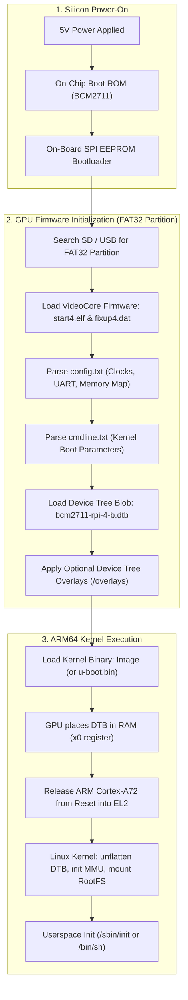
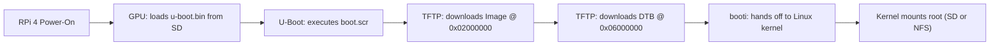
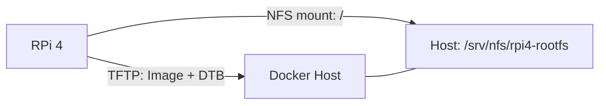
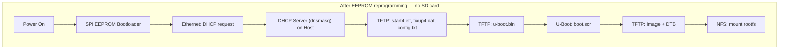

# Raspberry Pi 4: Manual Step-by-Step Linux Bringup Guide

> **Authoritative Platform Engineering Reference**  
> **Target Silicon:** Broadcom BCM2711 (Quad-Core ARM Cortex-A72 @ 1.5GHz / AArch64)  
> **Target Board:** Raspberry Pi 4 Model B  

---

## 1. Architectural Overview & Boot Pipeline

Before touching the SD card or terminal, understand the unique multi-stage boot sequence of the Raspberry Pi 4. Unlike standard x86 systems (BIOS/UEFI) or traditional ARM SoCs (SPL → U-Boot), **the Raspberry Pi is GPU-first silicon**: the VideoCore VI GPU initializes the hardware before releasing the ARM Cortex-A72 cores.



### Critical RPi 4 Hardware Distinctions
* **No `bootcode.bin` on SD card:** On the Raspberry Pi 3, `bootcode.bin` lived on the SD card. On Raspberry Pi 4, this stage is replaced by an **on-board 512KB SPI EEPROM** chip.
* **Firmware naming:** Pi 4 firmware binaries have a `4` suffix (`start4.elf`, `fixup4.dat`), unlike older Pis (`start.elf`, `fixup.dat`).
* **UART Logic:** The BCM2711 GPIO header operates at **3.3V LVCMOS**. Connecting a 5V serial adapter will permanently damage the SoC.

---

## 2. Hardware Bill of Materials & Serial Console Hookup

### 2.1 Required Equipment
1. **Raspberry Pi 4 Model B** (2GB, 4GB, or 8GB).
2. **USB-to-3.3V-TTL UART Cable** (Silicon Labs CP2102, FTDI FT232R, or Prolific PL2303).
3. **MicroSD Card** (16GB or 32GB Class 10 / UHS-1 recommended) + USB SD Card Reader.
4. **5V / 3A USB-C Power Supply** (Official Raspberry Pi PSU recommended).
5. **Host Machine or Docker Environment** (Ubuntu 22.04 LTS native or the monorepo Docker container: `./tools/docker/run.sh run`).

### 2.2 Serial Debug Cable Pinout (115200 Baud, 8N1)
The primary serial console (`ttyS0` / miniUART or `ttyAMA0` / PL011) routes to pins 6, 8, and 10 on the 40-pin GPIO header:

| Header Pin # | BCM Pin Name | Function | Wire Color (Standard) | Connect to USB-TTL Cable |
| :--- | :--- | :--- | :--- | :--- |
| **Pin 6** | `GND` | Ground | Black | **GND** |
| **Pin 8** | `GPIO 14` | TXD (Pi Output) | White / Green | **RXD** (Adapter Input) |
| **Pin 10** | `GPIO 15` | RXD (Pi Input) | Green / White | **TXD** (Adapter Output) |

> [!CAUTION]
> **DO NOT CONNECT THE RED (VCC / 5V / 3.3V) PIN!**  
> Power the Raspberry Pi exclusively through its USB-C port. Connecting the serial cable's power wire can cause ground loops, back-powering, or brownout resets.

---

## 3. SD Card Partitioning & Formatting

The Raspberry Pi bootloader requires a specific partition topology:
* **Partition 1 (`BOOT`):** FAT32 (Type `c` or `0x0c` W95 FAT32 LBA), minimum 256MB.
* **Partition 2 (`ROOTFS`):** ext4 (Linux native), taking up the remaining capacity.

### Step 3.1 Identify Your SD Card Device
Insert your SD card into your Linux host / workstation:
```bash
lsblk
# Identify your SD card device node carefully!
# Common nodes: /dev/sdb, /dev/sdc (USB reader) or /dev/mmcblk0 (internal reader)
```
> [!WARNING]
> Ensure you select the correct block device (referred to as `/dev/sdX` below). Writing to the wrong disk will destroy your host data.

### Step 3.2 Partition the Card
```bash
# Wipe previous partition table signatures
sudo wipefs -a /dev/sdX

# Partition with fdisk
sudo fdisk /dev/sdX
```
Inside `fdisk`, enter the following commands:
1. `o` → create a new empty DOS partition table.
2. `n` → new partition → `p` (primary) → `1` → First sector: `2048` → Last sector: `+512M`.
3. `t` → change partition type → `c` (W95 FAT32 LBA).
4. `n` → new partition → `p` (primary) → `2` → default first and last sectors (uses remaining disk).
5. `w` → write changes and exit.

### Step 3.3 Format the Filesystems
```bash
# Force kernel to re-read partition table
sudo partprobe /dev/sdX

# Format Partition 1 as FAT32
sudo mkfs.vfat -F 32 -n "BOOT" /dev/sdX1

# Format Partition 2 as ext4
sudo mkfs.ext4 -F -L "ROOTFS" /dev/sdX2
```

### Step 3.4 Create Mount Directories
```bash
mkdir -p /tmp/rpi-boot
mkdir -p /tmp/rpi-rootfs

sudo mount /dev/sdX1 /tmp/rpi-boot
sudo mount /dev/sdX2 /tmp/rpi-rootfs
```

---

## 4. Obtaining the VideoCore Firmware & Configuration

Raspberry Pi's VideoCore GPU requires proprietary firmware blobs to initialize the SoC memory and clocks before loading Linux.

### Step 4.1 Download Official Firmware Files
Fetch the minimal firmware binaries from the official Raspberry Pi GitHub firmware repository:
```bash
FW_DIR="/tmp/rpi-fw"
mkdir -p "${FW_DIR}"

BASE_URL="https://raw.githubusercontent.com/raspberrypi/firmware/master/boot"

wget -q --show-progress -O "${FW_DIR}/start4.elf" "${BASE_URL}/start4.elf"
wget -q --show-progress -O "${FW_DIR}/fixup4.dat" "${BASE_URL}/fixup4.dat"

# Optional firmware variants (e.g. debug/minimal):
# wget -O "${FW_DIR}/start4cd.elf" "${BASE_URL}/start4cd.elf"
# wget -O "${FW_DIR}/fixup4cd.dat" "${BASE_URL}/fixup4cd.dat"
```

Copy the firmware to the `BOOT` partition:
```bash
sudo cp "${FW_DIR}/start4.elf" /tmp/rpi-boot/
sudo cp "${FW_DIR}/fixup4.dat" /tmp/rpi-boot/
```

### Step 4.2 Create `config.txt`
Create `/tmp/rpi-boot/config.txt` to tell the GPU firmware how to configure clocks, UART, and load the 64-bit ARM Linux kernel:

```ini
# ==============================================================================
# Raspberry Pi 4 Manual 64-Bit Boot Configuration
# ==============================================================================

# Force ARM Cortex-A72 cores into 64-bit execution mode (AArch64)
arm_64bit=1

# Enable primary serial UART console (PL011 / ttyAMA0 on GPIO 14/15)
enable_uart=1
uart_2ndstage=1

# Explicitly specify the Linux kernel and device tree binary
kernel=Image
device_tree=bcm2711-rpi-4-b.dtb

# Allocate minimal memory to VideoCore GPU for headless/inspection operation (128MB)
gpu_mem=128

# Disable rainbow splash screen for faster boot
disable_splash=1

# Disable automatic overlay loading so we control the exact hardware layout
dtoverlay=
```

### Step 4.3 Create `cmdline.txt`
The GPU firmware reads `cmdline.txt` and passes its arguments to the Linux kernel via the `chosen/bootargs` Device Tree node.

> [!IMPORTANT]
> `cmdline.txt` **MUST be a single continuous line** with no newline/carriage return character at the end.

Create `/tmp/rpi-boot/cmdline.txt`:
```text
console=serial0,115200 console=tty1 root=/dev/mmcblk0p2 rw rootwait rootfstype=ext4 earlycon audit=0
```

#### Explanation of Parameters:
* `console=serial0,115200`: Directs `printk` and login getty to the physical UART at 115200 baud.
* `console=tty1`: Also duplicates output to the HDMI virtual terminal if a monitor is attached.
* `root=/dev/mmcblk0p2`: Tells the kernel to mount partition 2 of the SD card as the root filesystem.
* `rw`: Mounts the root filesystem read-write.
* `rootwait`: Forces kernel to pause initialization until the asynchronous SD/MMC card driver finishes probing.
* `rootfstype=ext4`: Avoids probing all filesystem drivers; mounts directly as ext4.
* `earlycon`: Enables early printk logging through the UART before the full TTY driver initializes.

---

## 5. Cross-Compiling the Linux Kernel & Device Tree (AArch64)

You can perform this step directly inside the monorepo Docker container or on your host.

### Step 5.1 Environment Setup
```bash
# Toolchain prefix (installed in Docker / Ubuntu: gcc-aarch64-linux-gnu)
export ARCH=arm64
export CROSS_COMPILE=aarch64-linux-gnu-
```

### Step 5.2 Clone the Raspberry Pi Kernel Source
We target the long-term stable `rpi-6.6.y` branch:
```bash
cd /workspace # or your preferred scratch directory
git clone --depth=1 --branch rpi-6.6.y https://github.com/raspberrypi/linux.git rpi-linux
cd rpi-linux
```

### Step 5.3 Configure the Kernel
Use the Broadcom 2711 64-bit default configuration:
```bash
make bcm2711_defconfig
```

#### Optional: Verify Critical Built-in Drivers (`make menuconfig`)
For a clean manual bringup, the following must be compiled **statically into the kernel (`=y`)**, NOT as loadable modules (`=m`), otherwise the kernel cannot read `/dev/mmcblk0p2` to mount root:
* `CONFIG_MMC=y`
* `CONFIG_MMC_BCM2835=y`
* `CONFIG_MMC_SDHCI_IPROC=y`
* `CONFIG_EXT4_FS=y`
* `CONFIG_SERIAL_8250=y`
* `CONFIG_SERIAL_AMBA_PL011=y`
* `CONFIG_SERIAL_AMBA_PL011_CONSOLE=y`

### Step 5.4 Compile Kernel, Modules & Device Tree
```bash
# Build using all CPU cores
make -j$(nproc) Image modules dtbs
```

### Step 5.5 Copy Kernel & DTB to `BOOT` Partition
```bash
# 1. Uncompressed 64-bit kernel image
sudo cp arch/arm64/boot/Image /tmp/rpi-boot/Image

# 2. Raspberry Pi 4 Model B Device Tree Blob
sudo cp arch/arm64/boot/dts/broadcom/bcm2711-rpi-4-b.dtb /tmp/rpi-boot/bcm2711-rpi-4-b.dtb

# 3. Device Tree Overlays directory
sudo mkdir -p /tmp/rpi-boot/overlays
sudo cp arch/arm64/boot/dts/overlays/*.dtbo /tmp/rpi-boot/overlays/
```

### Step 5.6 Install Kernel Modules to `ROOTFS` Partition
```bash
sudo make modules_install INSTALL_MOD_PATH=/tmp/rpi-rootfs
```
This installs kernel drivers into `/tmp/rpi-rootfs/lib/modules/<kernel-version>/`.

---

## 6. Building & Assembling the Custom Root Filesystem (RootFS)

You need a minimal userspace to spawn `/sbin/init` or `/bin/sh`. Choose between **Option A (Ultra-Minimal BusyBox)** or **Option B (Buildroot Appliance)**.

### Option A: Ultra-Minimal BusyBox RootFS (Recommended for First Bringup)

BusyBox combines tiny versions of common UNIX utilities into a single multi-call binary.

#### 1. Download & Build BusyBox
```bash
cd /workspace
git clone --depth=1 --branch 1_36_stable https://github.com/mirror/busybox.git
cd busybox

make defconfig
```

Configure static linking so BusyBox has no dynamic shared library dependencies:
```bash
# Enable static build
sed -i 's/# CONFIG_STATIC is not set/CONFIG_STATIC=y/' .config

make -j$(nproc) ARCH=arm64 CROSS_COMPILE=aarch64-linux-gnu- install CONFIG_PREFIX=/tmp/rpi-rootfs
```

#### 2. Create the Standard Linux Directory Hierarchy
```bash
cd /tmp/rpi-rootfs
sudo mkdir -p dev proc sys etc root home tmp var/log etc/init.d
sudo chmod 1777 tmp
```

#### 3. Create Essential Device Nodes
When the kernel boots without devtmpfs mounted, it requires `/dev/console` and `/dev/null`:
```bash
sudo mknod -m 600 /tmp/rpi-rootfs/dev/console c 5 1
sudo mknod -m 666 /tmp/rpi-rootfs/dev/null c 1 3
```

#### 4. Configure `/etc/inittab`
Create `/tmp/rpi-rootfs/etc/inittab`:
```ini
# /etc/inittab - Minimal BusyBox init configuration
::sysinit:/etc/init.d/rcS
::askfirst:-/bin/sh
::restart:/sbin/init
::ctrlaltdel:/sbin/reboot
::shutdown:/bin/umount -a -r
```

#### 5. Create `/etc/init.d/rcS` (Startup Script)
Create `/tmp/rpi-rootfs/etc/init.d/rcS`:
```bash
#!/bin/sh
# /etc/init.d/rcS - System startup script

# Mount pseudo filesystems
mount -t proc proc /proc
mount -t sysfs sysfs /sys
mount -t devtmpfs devtmpfs /dev
mkdir -p /dev/pts
mount -t devpts devpts /dev/pts

echo "=========================================================="
echo " Welcome to Soliton ARM Embedded Linux Lab — Pi 4 Bringup"
echo " Kernel: $(uname -r) on $(uname -m)"
echo "=========================================================="
```
Make the startup script executable:
```bash
sudo chmod +x /tmp/rpi-rootfs/etc/init.d/rcS
```

---

## 7. Syncing & Unmounting the SD Card

Before ejecting the card, ensure all write buffers are completely flushed to flash:
```bash
sync

sudo umount /tmp/rpi-boot
sudo umount /tmp/rpi-rootfs

rmdir /tmp/rpi-boot /tmp/rpi-rootfs
```
Now safely unplug the MicroSD card from your workstation.

---

## 8. Power-On & First Boot Session

### Step 8.1 Connect Serial Console
1. Connect your USB-to-TTL UART adapter to your host PC.
2. Verify the device file:
   ```bash
   ls /dev/ttyUSB* /dev/ttyACM*
   # Typically /dev/ttyUSB0
   ```
3. Open the serial console using the `lab` task runner or `picocom`:
   ```bash
   # Option 1: Using monorepo lab CLI
   ./lab console --board=rpi4

   # Option 2: Using picocom directly
   picocom -b 115200 /dev/ttyUSB0
   ```

### Step 8.2 Insert SD Card and Power On
1. Insert the MicroSD card into the Raspberry Pi 4 slot.
2. Connect the USB-C power supply.
3. Observe the serial output in your terminal window.

### Step 8.3 Expected Boot Log Sequence
```text
[    0.000000] Booting Linux on physical CPU 0x0000000000 [0x410fd083]
[    0.000000] Linux version 6.6.y (aarch64-linux-gnu-gcc) ...
[    0.000000] Machine model: Raspberry Pi 4 Model B Rev 1.4
[    0.000000] earlycon: pl11 at MMIO 0x00000000fe201000 (options '115200')
[    0.000000] printk: bootconsole [pl11] enabled
...
[    1.234567] mmc0: new high speed SDHC card at address aaaa
[    1.240123] mmcblk0: mmc0:aaaa SC32G 29.7 GiB
[    1.245000]  mmcblk0: p1 p2
[    1.890000] EXT4-fs (mmcblk0p2): mounted filesystem with ordered data mode
[    1.895000] VFS: Mounted root (ext4 filesystem) on device 179:2.
[    1.905000] Run /sbin/init as init process
==========================================================
 Welcome to Soliton ARM Embedded Linux Lab — Pi 4 Bringup
 Kernel: 6.6.y on aarch64
==========================================================
Please press Enter to activate this console.
/ # 
```

**Congratulations!** You have completed a 100% manual, bare-metal bringup of custom Linux on the Raspberry Pi 4.

---

## 9. Fast-Iteration: U-Boot + TFTP Boot (Current Working Setup)

Swapping SD cards during active kernel development is a bottleneck. The monorepo uses **static-IP TFTP network loading** with U-Boot: the SD card holds only the rarely-changing bootloader files (`start4.elf`, `fixup4.dat`, `config.txt`, `u-boot.bin`, `boot.scr`); the kernel and DTB are served over TFTP from the host on every boot.



### 9.1 Cross-Compile U-Boot for Pi 4

The monorepo already includes U-Boot as a Git submodule at `shared/boot/u-boot` with a board-aware build system. Build inside the Docker container:

```bash
# Inside Docker container
cd /workspace/shared/boot
make BOARD=rpi4          # configures + compiles U-Boot
# Output: build/rpi4/u-boot.bin
```

A pre-built `u-boot.bin` is committed at [`shared/bsp/rpi4/u-boot.bin`](../../shared/bsp/rpi4/u-boot.bin). Rebuild only when changing U-Boot config. See `shared/boot/Makefile` for available targets (`defconfig`, `menuconfig`, `clean`, `distclean`).

### 9.2 SD Card BOOT Partition Contents
The FAT32 partition only needs these files (all committed in `shared/bsp/rpi4/`):

| File | Source | Purpose |
|:---|:---|:---|
| `start4.elf` | RPi firmware | VideoCore GPU firmware |
| `fixup4.dat` | RPi firmware | Memory split configuration |
| `config.txt` | `shared/bsp/rpi4/config.txt` | `kernel=u-boot.bin`, UART, 64-bit |
| `u-boot.bin` | Built in Docker | Second-stage bootloader |
| `boot.scr` | Compiled from `boot.cmd` | U-Boot autoboot script |

Deploy to a mounted SD card with:
```bash
cd shared/boot
make deploy-sd BOARD=rpi4
```

### 9.3 Serve Artifacts over TFTP
The Docker container runs a TFTP server on `/workspace/tftp`. Copy your build outputs:
```bash
cp arch/arm64/boot/Image /workspace/tftp/Image
cp arch/arm64/boot/dts/broadcom/bcm2711-rpi-4-b.dtb /workspace/tftp/bcm2711-rpi-4-b.dtb
```

### 9.4 Current `boot.scr` Logic
See [`shared/bsp/rpi4/boot.cmd`](../../shared/bsp/rpi4/boot.cmd). Key addresses:

| Artifact | Load Address | Reason |
|:---|:---|:---|
| `Image` | `0x02000000` | Standard AArch64 kernel load address |
| `bcm2711-rpi-4-b.dtb` | `0x06000000` | Well past kernel (~40 MB), avoids overlap |

> [!IMPORTANT]
> **Do not use `0x03000000` for DTB.** The kernel `Image` is ~45 MB; placing the DTB at `0x03000000` (only 16 MB above kernel base) causes "FDT image overlaps OS image" and a boot hang.

### 9.5 Manual U-Boot Prompt (Interactive Debug)
Interrupt autoboot by pressing any key over serial, then:
```text
U-Boot> setenv ipaddr    192.168.1.150
U-Boot> setenv serverip  192.168.1.220
U-Boot> tftp 0x02000000 Image
U-Boot> tftp 0x06000000 bcm2711-rpi-4-b.dtb
U-Boot> setenv bootargs "console=serial0,115200 console=tty1 root=/dev/mmcblk0p2 rw rootwait rootfstype=ext4 earlycon"
U-Boot> booti 0x02000000 - 0x06000000
```

---

## 10. BusyBox NFS Root Filesystem

Instead of mounting a root filesystem from the SD card (`/dev/mmcblk0p2`), the kernel can mount a directory exported by the host over NFS. This eliminates all per-rootfs SD card writes — every change to userspace is made on the host and is instantly visible to the Pi on the next boot.



### 10.1 Required Kernel Config

The running kernel must have these options compiled **statically** (`=y`), not as modules:

```
CONFIG_NFS_FS=y
CONFIG_NFS_V3=y
CONFIG_ROOT_NFS=y
CONFIG_IP_PNP=y
CONFIG_IP_PNP_DHCP=y     # if using ip=dhcp
CONFIG_IP_PNP_BOOTP=y
```

Verify with:
```bash
zcat /proc/config.gz | grep -E 'NFS|IP_PNP'
# or during build inside Docker:
grep -E 'CONFIG_NFS|CONFIG_IP_PNP' /workspace/rpi-linux/.config
```

If any are `=m`, run `make menuconfig` → `File systems → Network File Systems → NFS client` and set them to `*`, then rebuild the kernel.

### 10.2 Build a Minimal BusyBox RootFS (on Host)

Follow the same BusyBox cross-compile and rootfs assembly procedure from [Section 6 — Option A](#option-a-ultra-minimal-busybox-rootfs-recommended-for-first-bringup), but install into the NFS export directory instead of the SD card partition:

```bash
# Inside Docker container — cross-compile BusyBox
cd /workspace
git clone --depth=1 --branch 1_36_stable https://github.com/mirror/busybox.git
cd busybox
make defconfig
sed -i 's/# CONFIG_STATIC is not set/CONFIG_STATIC=y/' .config
make -j$(nproc) ARCH=arm64 CROSS_COMPILE=aarch64-linux-gnu-
make install CONFIG_PREFIX=/workspace/nfs/rpi4-rootfs
```

Then on the **host**, copy the output to the NFS export directory and create the rootfs structure (directories, device nodes, `inittab`, `rcS`) exactly as described in Section 6:

```bash
export ROOTFS=/srv/nfs/rpi4-rootfs
sudo mkdir -p ${ROOTFS}
sudo cp -a /workspace/nfs/rpi4-rootfs/. ${ROOTFS}/

# Create directories, device nodes, inittab, and rcS — see Section 6 steps 2-5
```

### 10.3 Configure NFS Export on Host

#### Install NFS Server
```bash
# Ubuntu / Debian
sudo apt install -y nfs-kernel-server
```

#### Add Export
Append to `/etc/exports`:
```text
/srv/nfs/rpi4-rootfs  192.168.1.0/24(rw,sync,no_subtree_check,no_root_squash)
```

Apply:
```bash
sudo exportfs -ra
sudo systemctl restart nfs-kernel-server

# Verify
showmount -e localhost
```

> [!NOTE]
> `no_root_squash` is required. Without it, the kernel's NFS root mount will fail trying to create device nodes owned by `root`.

### 10.4 Update `boot.cmd` for NFS Boot

Edit [`shared/bsp/rpi4/boot.cmd`](../../shared/bsp/rpi4/boot.cmd) — change `setenv bootargs`:

```bash
# Replace the existing bootargs line:
setenv bootargs "console=serial0,115200 console=tty1 \
  root=/dev/nfs \
  nfsroot=192.168.1.220:/srv/nfs/rpi4-rootfs,v3,tcp \
  ip=192.168.1.150:::255.255.255.0:rpi4:eth0:off \
  rw earlycon audit=0"
```

Key parameters:

| Parameter | Purpose |
|:---|:---|
| `root=/dev/nfs` | Tell kernel to use NFS as root |
| `nfsroot=<hostip>:<path>,v3,tcp` | Host IP, exported path, NFS version, transport |
| `ip=<static-config>` | Static IP for the Pi (avoid DHCP dependency at boot) |
| `rw` | Mount root read-write |

Recompile and deploy:
```bash
# Inside Docker
mkimage -C none -A arm64 -T script -d shared/bsp/rpi4/boot.cmd shared/bsp/rpi4/boot.scr

# On host — copy to SD card BOOT partition
cp shared/bsp/rpi4/boot.scr /media/$USER/BOOT/
```

### 10.5 Expected NFS Mount Log
```text
[    2.345678] NFS: Mounting 192.168.1.220:/srv/nfs/rpi4-rootfs on /
[    2.789012] VFS: Mounted root (nfs filesystem) on device 0:14.
[    2.801234] Run /sbin/init as init process
===========================================================
 Soliton ARM Embedded Linux Lab — RPi4 NFS Root
 Kernel : 6.6.y | Arch: aarch64
===========================================================
Please press Enter to activate this console.
/ #
```

---

## 11. Eliminating the SD Card — Full Network Boot via EEPROM

The RPi4 SPI EEPROM bootloader (not the SD card) is the true first stage. It can be **reprogrammed to boot over the network (PXE/TFTP)** without any SD card at all. After a one-time EEPROM update, the Pi contacts a DHCP+TFTP server on power-on and downloads the entire boot chain.



> [!NOTE]
> Standard Raspberry Pi 4 Model B does **not** have built-in eMMC (that is the Compute Module 4). The EEPROM only stores the boot *configuration*, not the firmware. Firmware (`start4.elf`) must still be served — but via TFTP from the host instead of from SD.

### 11.1 One-Time EEPROM Reprogramming (Requires SD Card Once)

This step needs a running RPi OS on an SD card (or a USB drive). Do it once, then discard the card.

#### Step 1 — Boot an Official RPi OS Image
Flash the latest **Raspberry Pi OS Lite (64-bit)** with [Raspberry Pi Imager](https://www.raspberrypi.com/software/) to a microSD card and boot it. This gives you access to `rpi-eeprom-config`.

#### Step 2 — Check Current EEPROM Bootloader Version
```bash
sudo rpi-eeprom-update
```

#### Step 3 — Extract and Edit EEPROM Config
```bash
# Dump the current EEPROM config to a file
sudo rpi-eeprom-config --out /tmp/boot.conf
```

The critical field is `BOOT_ORDER`. Update `/tmp/boot.conf`:
```ini
[all]
BOOT_UART=1

# Boot order: try network first (0x2), then USB (0x4), then SD (0x1) as fallback
# Digits are tried right-to-left
BOOT_ORDER=0xf241

# Timeout before moving to next boot mode (100ms units)
BOOT_ORDER_TIMEOUT=5

# Allow Network boot without SD/USB present
NETWORK_INSTALL_ENABLED=1
```

`BOOT_ORDER` digit meanings:

| Digit | Mode |
|:---:|:---|
| `0x1` | SD card |
| `0x2` | Network (PXE/TFTP) |
| `0x4` | USB mass storage |
| `0xf` | Restart from first mode |

#### Step 4 — Flash the New Config
```bash
sudo rpi-eeprom-config --apply /tmp/boot.conf

# Verify
sudo rpi-eeprom-config
```

Reboot and remove the SD card — the Pi will now attempt network boot on next power-on.

---

### 11.2 Host DHCP + TFTP Server Setup (dnsmasq)

The Pi's EEPROM sends a DHCP broadcast over Ethernet. The host must answer with an IP and a TFTP server path pointing to the firmware files.

#### Install dnsmasq
```bash
# Ubuntu / Debian
sudo apt install -y dnsmasq
```

#### Configure `/etc/dnsmasq.conf`

Replace or append (adjust interface and IP range for your network):
```ini
# ================================================================
# dnsmasq — DHCP + TFTP for RPi4 network boot (no SD card)
# ================================================================

# Listen only on the LAN interface connected to the Pi
interface=enp2s0           # <-- change to your host's LAN interface
bind-interfaces

# DHCP range — hand out one IP (or a range) to the Pi
dhcp-range=192.168.1.150,192.168.1.160,255.255.255.0,12h

# Assign a predictable IP to the Pi by MAC (recommended)
# dhcp-host=dc:a6:32:xx:xx:xx,rpi4,192.168.1.150

# TFTP server root — all firmware files go here
enable-tftp
tftp-root=/srv/tftp/rpi4

# PXE boot file for RPi4 (EEPROM fetches this first)
dhcp-boot=start4.elf

# Log DHCP and TFTP activity
log-dhcp
log-queries
```

#### Create TFTP Root and Populate Firmware
```bash
ROOT=/srv/tftp/rpi4
sudo mkdir -p ${ROOT}

# Copy RPi firmware (from shared/bsp/rpi4/ in the monorepo)
REPO=/path/to/arm-embedded-linux-lab   # <-- adjust to your local clone

sudo cp ${REPO}/shared/bsp/rpi4/start4.elf   ${ROOT}/
sudo cp ${REPO}/shared/bsp/rpi4/fixup4.dat   ${ROOT}/
sudo cp ${REPO}/shared/bsp/rpi4/config.txt   ${ROOT}/
sudo cp ${REPO}/shared/bsp/rpi4/u-boot.bin   ${ROOT}/
sudo cp ${REPO}/shared/bsp/rpi4/boot.scr     ${ROOT}/
```

Kernel and DTB are still served by the Docker TFTP server (port 69) during U-Boot's `boot.scr`. If you want everything from one server, also copy these to `${ROOT}` and point U-Boot's `serverip` to the host.

#### Restart dnsmasq
```bash
sudo systemctl restart dnsmasq
sudo systemctl status  dnsmasq
```

> [!WARNING]
> If your host already runs a DHCP server (e.g., NetworkManager), dnsmasq will conflict on port 67. Either: (a) disable the existing DHCP server for the Pi-facing interface, or (b) run dnsmasq only on the Pi-facing interface with `bind-interfaces`.

### 11.3 Network Topology

```
┌─────────────────────────────────────────────────────┐
│  Host Workstation (192.168.1.220)                   │
│                                                     │
│  ┌──────────────┐  ┌──────────────┐  ┌──────────┐  │
│  │ dnsmasq      │  │ Docker TFTP  │  │ NFS      │  │
│  │ DHCP + TFTP  │  │ (port 69)    │  │ Server   │  │
│  │ /srv/tftp/   │  │ /workspace/  │  │ /srv/nfs/│  │
│  │   rpi4/      │  │   tftp/      │  │   rpi4-  │  │
│  └──────┬───────┘  └──────┬───────┘  │   rootfs │  │
│         │                 │          └────┬─────┘  │
└─────────┼─────────────────┼───────────────┼────────┘
          │    Gigabit Ethernet (enp2s0)     │
          └─────────────────┬───────────────┘
                            │
               ┌────────────▼──────────┐
               │  Raspberry Pi 4       │
               │  192.168.1.150        │
               │  (no SD card)         │
               └───────────────────────┘
```

### 11.4 Verifying Network Boot

Watch dnsmasq logs while powering on the Pi:
```bash
sudo journalctl -fu dnsmasq
```

Expected sequence:
```text
dnsmasq-dhcp: DHCPDISCOVER(enp2s0) dc:a6:32:xx:xx:xx
dnsmasq-dhcp: DHCPOFFER(enp2s0)    192.168.1.150 dc:a6:32:xx:xx:xx
dnsmasq-tftp: sent /srv/tftp/rpi4/start4.elf
dnsmasq-tftp: sent /srv/tftp/rpi4/fixup4.dat
dnsmasq-tftp: sent /srv/tftp/rpi4/config.txt
dnsmasq-tftp: sent /srv/tftp/rpi4/u-boot.bin
dnsmasq-tftp: sent /srv/tftp/rpi4/boot.scr
```

Then U-Boot fetches `Image` and `bcm2711-rpi-4-b.dtb` via TFTP (Docker TFTP server), and the kernel mounts the NFS rootfs.

---

## 12. Troubleshooting & Diagnostic Runbook

### Issue 1: Green ACT LED Error Blinks
If the Pi fails before the serial console starts, inspect the ACT LED flash patterns:

| Flash Pattern | Diagnosis | Resolution |
| :--- | :--- | :--- |
| **Solid ON / No blink** | No boot code executed | SPI EEPROM corrupt. Reprogram with Raspberry Pi Imager. |
| **3 flashes** | `start4.elf` not found | Partition 1 not FAT32, missing file, or card not seated. |
| **4 flashes** | `start4.elf` cannot launch | Corrupt firmware. Re-download from RPi firmware repo. |
| **7 flashes** | Kernel image not found | `kernel=` in `config.txt` does not match the file on BOOT. |
| **8 flashes** | SDRAM not recognized | Hardware defect or unsupported RAM revision. |

### Issue 2: Serial Console Silent After `bootconsole [bcm2835aux0] disabled`

This is **not a hang**. The kernel switched from the mini-UART early console to the proper console driver. If your terminal goes silent here:
- Confirm `console=serial0,115200` is in `bootargs` in `boot.cmd`.
- Confirm `enable_uart=1` is in `config.txt`.
- The kernel continues booting on HDMI — check your monitor.
- If truly hung after this, likely a rootfs mount failure (see Issue 4 / Issue 5).

### Issue 3: Kernel Panics: `VFS: Unable to mount root fs on unknown-block(0,0)`
* `CONFIG_MMC_BCM2835=y` and `CONFIG_MMC_SDHCI_IPROC=y` must be built-in.
* Add `rootwait` to `bootargs`.
* Verify `root=/dev/mmcblk0p2` path.

### Issue 4: NFS Mount Fails — `VFS: Unable to mount root fs via NFS`
* Verify NFS server is running: `sudo systemctl status nfs-kernel-server`.
* Verify export is active: `showmount -e localhost`.
* Verify Pi can reach host IP: from U-Boot prompt, `ping 192.168.1.220`.
* Check NFS export has `no_root_squash`.
* Confirm kernel has `CONFIG_NFS_FS=y` and `CONFIG_ROOT_NFS=y` (not `=m`).
* Check `nfsroot=` in `bootargs` matches the exported path exactly.

### Issue 5: EEPROM Netboot — Pi Gets IP but TFTP Fails
* Confirm `start4.elf` is in the TFTP root (`/srv/tftp/rpi4/`).
* Check dnsmasq logs: `sudo journalctl -fu dnsmasq`.
* Port 69 (TFTP UDP) must not be blocked by firewall: `sudo ufw allow 69/udp`.
* Ensure dnsmasq is bound to the correct interface (`interface=enp2s0`).

### Issue 6: EEPROM Netboot — Pi Does Not Send DHCP Request
* Hold EEPROM boot order did not take effect. Re-verify with `sudo rpi-eeprom-config`.
* Make sure Ethernet cable is connected **before** powering on (EEPROM checks link state).
* Try `BOOT_ORDER=0xf2` (network-only, no fallback) to force network-only mode and see UART output.

### Issue 7: Kernel Freezes at `Starting kernel ...` (U-Boot)
* DTB compiled without `ARCH=arm64`.
* DTB load address overlaps kernel. Use `0x06000000` for DTB, not `0x03000000`.

### Issue 8: U-Boot `FDT image overlaps OS image`
Move the DTB load address higher: use `0x06000000` instead of `0x03000000`. The `Image` kernel is ~45 MB; any address below `0x05000000` risks overlap.

---

## 13. Monorepo Integration Checklist

Once your board boots successfully into userspace:
- [x] Serial console working via `./lab console --board=rpi4`
- [x] Kernel + DTB served over TFTP (Docker container running)
- [ ] BusyBox NFS rootfs built and exported from host
- [ ] `boot.cmd` updated to `root=/dev/nfs nfsroot=...`
- [ ] EEPROM reprogrammed with `BOOT_ORDER=0xf241` (optional, for SD-card elimination)
- [ ] dnsmasq configured and serving firmware from `/srv/tftp/rpi4/`
- [x] Build and deploy projects: `./lab build --project=<name> --board=rpi4`
- [x] Run diagnostics: `./lab doctor` (inside Docker)
