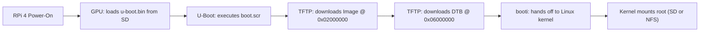
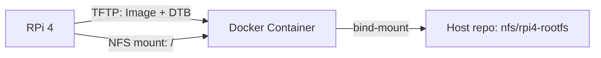

# Raspberry Pi 4: U-Boot, TFTP & NFS Boot

## 1. Power-On & First Boot Session

### Step 1.1 Connect Serial Console
1. Connect your USB-to-TTL UART adapter to your host PC (see [Boot Architecture](boot_architecture.md) for pinout).
2. Verify the device file:
   ```bash
   ls /dev/ttyUSB* /dev/ttyACM*
   # Typically /dev/ttyUSB0
   ```
3. Open the serial console using the `lab` task runner or `picocom`:
   ```bash
   # Option 1: Using monorepo lab CLI
   ./lab console --board=rpi4

   # Option 2: Using picocom directly
   picocom -b 115200 /dev/ttyUSB0
   ```

### Step 1.2 Insert SD Card and Power On
1. Insert the MicroSD card into the Raspberry Pi 4 slot.
2. Connect the USB-C power supply.
3. Observe the serial output in your terminal window.

### Step 1.3 Expected Boot Log Sequence
```text
[    0.000000] Booting Linux on physical CPU 0x0000000000 [0x410fd083]
[    0.000000] Linux version 6.6.y (aarch64-linux-gnu-gcc) ...
[    0.000000] Machine model: Raspberry Pi 4 Model B Rev 1.4
[    0.000000] earlycon: pl11 at MMIO 0x00000000fe201000 (options '115200')
[    0.000000] printk: bootconsole [pl11] enabled
...
[    1.234567] mmc0: new high speed SDHC card at address aaaa
[    1.240123] mmcblk0: mmc0:aaaa SC32G 29.7 GiB
[    1.245000]  mmcblk0: p1 p2
[    1.890000] EXT4-fs (mmcblk0p2): mounted filesystem with ordered data mode
[    1.895000] VFS: Mounted root (ext4 filesystem) on device 179:2.
[    1.905000] Run /sbin/init as init process
==========================================================
 Welcome to Soliton ARM Embedded Linux Lab — Pi 4 Bringup
 Kernel: 6.6.y on aarch64
==========================================================
Please press Enter to activate this console.
/ # 
```

**Congratulations!** You have completed a 100% manual, bare-metal bringup of custom Linux on the Raspberry Pi 4.

---

## 2. Fast-Iteration: U-Boot + TFTP Boot (Current Working Setup)

Swapping SD cards during active kernel development is a bottleneck. The monorepo uses **static-IP TFTP network loading** with U-Boot: the SD card holds only the rarely-changing bootloader files (`start4.elf`, `fixup4.dat`, `config.txt`, `u-boot.bin`, `boot.scr`); the kernel and DTB are served over TFTP from the host on every boot.



### 2.1 Cross-Compile U-Boot for Pi 4

The monorepo already includes U-Boot as a Git submodule at `shared/boot/u-boot` with a board-aware build system. Build inside the Docker container:

```bash
# Inside Docker container
cd /workspace/shared/boot
make BOARD=rpi4          # configures + compiles U-Boot
# Output: build/rpi4/u-boot.bin
```

A pre-built `u-boot.bin` is committed at [`shared/bsp/rpi4/u-boot.bin`](../../shared/bsp/rpi4/u-boot.bin). Rebuild only when changing U-Boot config. See `shared/boot/Makefile` for available targets (`defconfig`, `menuconfig`, `clean`, `distclean`).

### 2.2 SD Card BOOT Partition Contents
The FAT32 partition only needs these files (all committed in `shared/bsp/rpi4/`):

| File | Source | Purpose |
|:---|:---|:---|
| `start4.elf` | RPi firmware | VideoCore GPU firmware |
| `fixup4.dat` | RPi firmware | Memory split configuration |
| `config.txt` | `shared/bsp/rpi4/config.txt` | `kernel=u-boot.bin`, UART, 64-bit |
| `u-boot.bin` | Built in Docker | Second-stage bootloader |
| `boot.scr` | Compiled from `boot.cmd` | U-Boot autoboot script |

Deploy to a mounted SD card with:
```bash
cd shared/boot
make deploy-sd BOARD=rpi4
```

### 2.3 Serve Artifacts over TFTP
The Docker container runs a TFTP server on `/workspace/tftp`. Copy your build outputs:
```bash
cp arch/arm64/boot/Image /workspace/tftp/Image
cp arch/arm64/boot/dts/broadcom/bcm2711-rpi-4-b.dtb /workspace/tftp/bcm2711-rpi-4-b.dtb
```

### 2.4 Current `boot.scr` Logic
See [`shared/bsp/rpi4/boot.cmd`](../../shared/bsp/rpi4/boot.cmd). Key addresses:

| Artifact | Load Address | Reason |
|:---|:---|:---|
| `Image` | `0x02000000` | Standard AArch64 kernel load address |
| `bcm2711-rpi-4-b.dtb` | `0x06000000` | Well past kernel (~40 MB), avoids overlap |

> [!IMPORTANT]
> **Do not use `0x03000000` for DTB.** The kernel `Image` is ~45 MB; placing the DTB at `0x03000000` (only 16 MB above kernel base) causes "FDT image overlaps OS image" and a boot hang.

### 2.5 Manual U-Boot Prompt (Interactive Debug)
Interrupt autoboot by pressing any key over serial, then:
```text
U-Boot> setenv ipaddr    192.168.1.150
U-Boot> setenv serverip  192.168.1.220
U-Boot> tftp 0x02000000 Image
U-Boot> tftp 0x06000000 bcm2711-rpi-4-b.dtb
U-Boot> setenv bootargs "console=serial0,115200 console=tty1 root=/dev/mmcblk0p2 rw rootwait rootfstype=ext4 earlycon"
U-Boot> booti 0x02000000 - 0x06000000
```

---

## 3. BusyBox NFS Root Filesystem

Instead of mounting a root filesystem from the SD card (`/dev/mmcblk0p2`), the kernel can mount a directory exported by the host over NFS. This eliminates all per-rootfs SD card writes — every change to userspace is made on the host and is instantly visible to the Pi on the next boot.



The NFS server runs **inside the Docker container**. `tools/docker/entrypoint.sh` starts it automatically and exports `/workspace/nfs` (the `nfs/` directory bind-mounted from the repo) to `192.168.1.0/24`. No separate NFS installation on the host is needed.

### 3.1 Required Kernel Config

The running kernel must have these options compiled **statically** (`=y`), not as modules:

```
CONFIG_NFS_FS=y
CONFIG_NFS_V3=y
CONFIG_ROOT_NFS=y
CONFIG_IP_PNP=y
CONFIG_IP_PNP_DHCP=y     # if using ip=dhcp
CONFIG_IP_PNP_BOOTP=y
```

Verify with:
```bash
zcat /proc/config.gz | grep -E 'NFS|IP_PNP'
# or during build inside Docker:
grep -E 'CONFIG_NFS|CONFIG_IP_PNP' /workspace/rpi-linux/.config
```

If any are `=m`, run `make menuconfig` → `File systems → Network File Systems → NFS client` and set them to `*`, then rebuild the kernel.

### 3.2 Populate the NFS Root Filesystem

A pre-built rootfs is already committed at `nfs/rpi4-rootfs/`. To rebuild it or extend it, follow [.agents/workflows/nfs_rootfs.md](../../.agents/workflows/nfs_rootfs.md).

To add or modify files, edit them directly under `nfs/rpi4-rootfs/` in the repository. The Docker container exports the directory live — changes are visible to the Pi on the next boot without any copy or flash step.

### 3.3 Start the Docker Container (NFS Server Included)

```bash
./tools/docker/run.sh run
```

The container entrypoint automatically:
1. Loads the `nfsd` kernel module from the host.
2. Starts `rpcbind` and `nfs-kernel-server`.
3. Exports `/workspace/nfs` to `192.168.1.0/24` with `rw,sync,no_subtree_check,no_root_squash`.

You will see this line in the container startup output:
```
❯ [NFS] Exporting /workspace/nfs to 192.168.1.0/24
```

**Host firewall (UFW):** If UFW is active, allow NFS traffic before starting the container:
```bash
sudo ufw allow 2049/tcp
sudo ufw allow 2049/udp
sudo ufw allow 111/tcp
sudo ufw allow 111/udp
```

**Verify the export** from within the container or from another host:
```bash
showmount -e 192.168.1.220
# Expected: /workspace/nfs  192.168.1.0/24
```

> [!NOTE]
> `no_root_squash` is required. Without it, the kernel's NFS root mount will fail trying to create device nodes owned by `root`.

> [!NOTE]
> On WSL2, `modprobe nfsd` may fail because the WSL2 Microsoft kernel does not include the `nfsd` module. In that case, run an NFS server natively on the Windows host using Windows Services for NFS, or use a Linux VM.

### 3.4 `boot.cmd` NFS Boot Arguments

[`shared/bsp/rpi4/boot.cmd`](../../shared/bsp/rpi4/boot.cmd) already contains the NFS `bootargs`. The current configuration:

```bash
setenv bootargs "console=ttyS0,115200 console=tty1 root=/dev/nfs rw rootwait \
  nfsroot=192.168.1.220:/workspace/nfs/rpi4-rootfs,tcp,v3 \
  ip=192.168.1.150:::255.255.255.0:rpi4:eth0:off \
  earlycon=bcm2835aux,0xfe215040"
```

Key parameters:

| Parameter | Purpose |
|:---|:---|
| `root=/dev/nfs` | Tell kernel to use NFS as root |
| `nfsroot=<hostip>:<path>,tcp,v3` | Docker host IP, exported path, NFSv3 over TCP |
| `ip=<static-config>` | Static IP for the Pi (no DHCP dependency at boot) |
| `rw rootwait` | Mount root read-write; wait for network before mounting |

If you change the NFS path or host IP, recompile `boot.scr` and copy it to the SD card BOOT partition:
```bash
# Inside Docker container
mkimage -C none -A arm64 -T script -d shared/bsp/rpi4/boot.cmd shared/bsp/rpi4/boot.scr
# Then copy boot.scr to the SD card BOOT partition
```

### 3.5 Expected NFS Mount Log
```text
[    2.345678] NFS: Mounting 192.168.1.220:/workspace/nfs/rpi4-rootfs on /
[    2.789012] VFS: Mounted root (nfs filesystem) on device 0:14.
[    2.801234] Run /sbin/init as init process
==========================================================
 Welcome to Soliton ARM Embedded Linux Lab — Pi 4 Bringup
 Kernel: 6.6.y on aarch64
==========================================================
Please press Enter to activate this console.
/ #
```

---

## 4. Troubleshooting

### Issue 1: Green ACT LED Error Blinks
If the Pi fails before the serial console starts, inspect the ACT LED flash patterns:

| Flash Pattern | Diagnosis | Resolution |
| :--- | :--- | :--- |
| **Solid ON / No blink** | No boot code executed | SPI EEPROM corrupt. Reprogram with Raspberry Pi Imager. |
| **3 flashes** | `start4.elf` not found | Partition 1 not FAT32, missing file, or card not seated. |
| **4 flashes** | `start4.elf` cannot launch | Corrupt firmware. Re-download from RPi firmware repo. |
| **7 flashes** | Kernel image not found | `kernel=` in `config.txt` does not match the file on BOOT. |
| **8 flashes** | SDRAM not recognized | Hardware defect or unsupported RAM revision. |

### Issue 2: Serial Console Silent After `bootconsole [bcm2835aux0] disabled`

This is **not a hang**. The kernel switched from the mini-UART early console to the proper console driver. If your terminal goes silent here:
- Confirm `console=serial0,115200` is in `bootargs` in `boot.cmd`.
- Confirm `enable_uart=1` is in `config.txt`.
- The kernel continues booting on HDMI — check your monitor.
- If truly hung after this, likely a rootfs mount failure (see Issue 3 / Issue 4).

### Issue 3: Kernel Panics: `VFS: Unable to mount root fs on unknown-block(0,0)`
* `CONFIG_MMC_BCM2835=y` and `CONFIG_MMC_SDHCI_IPROC=y` must be built-in.
* Add `rootwait` to `bootargs`.
* Verify `root=/dev/mmcblk0p2` path.

### Issue 4: NFS Mount Fails — `VFS: Unable to mount root fs via NFS`
* Verify NFS server is running: `sudo systemctl status nfs-kernel-server`.
* Verify export is active: `showmount -e localhost`.
* Verify Pi can reach host IP: from U-Boot prompt, `ping 192.168.1.220`.
* Check NFS export has `no_root_squash`.
* Confirm kernel has `CONFIG_NFS_FS=y` and `CONFIG_ROOT_NFS=y` (not `=m`).
* Check `nfsroot=` in `bootargs` matches the exported path exactly.

### Issue 5: Kernel Freezes at `Starting kernel ...` (U-Boot)
* DTB compiled without `ARCH=arm64`.
* DTB load address overlaps kernel. Use `0x06000000` for DTB, not `0x03000000`.

### Issue 6: U-Boot `FDT image overlaps OS image`
Move the DTB load address higher: use `0x06000000` instead of `0x03000000`. The `Image` kernel is ~45 MB; any address below `0x05000000` risks overlap.

---

**Previous:** [BusyBox Root Filesystem](rootfs_busybox.md) | **Next:** [EEPROM Network Boot](eeprom_netboot.md)
