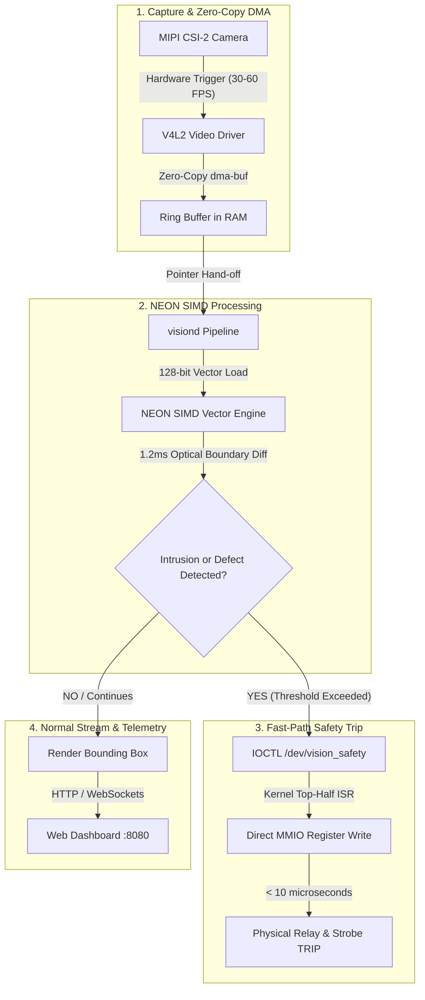

# Project VisionEdge: Industrial Inspection & Safety Platform

> **Flagship Platform Engineering Project | ARM Embedded Linux Lab**  
> **Target Hardware:** Raspberry Pi 4 (Broadcom BCM2711 / Quad-Core ARM Cortex-A72 @ 1.5GHz / AArch64) + Camera Module / USB UVC  
> **Simulation Target:** QEMU ARM64 (`qemu-system-aarch64 -M virt`)

---

## 1. Project Overview & Context

This project is the flagship learning track inside the **Soliton ARM Embedded Linux Lab** monorepo. It is designed to take engineers from application-level software development into **full-stack Cortex-A platform engineering**.

Rather than running generic tutorials, all learning throughout this track is anchored to building a single, cohesive, production-grade industrial appliance: the **VisionEdge Industrial In-Line Inspection & Safety Gateway**.

---

## 2. System Overview & Engineering Goals

### 2.1 Target Architecture & Domain
- **Domain:** **Industrial Automation, Industrial IoT (IIoT), and Semiconductor Equipment** (In-line automated optical inspection, cleanroom tooling, and optical safety interlock systems).
- **Appliance Identity:** `VisionEdge Industrial In-Line Inspection & Safety Gateway` running on the **Raspberry Pi 4** (BCM2711 / Quad-Core Cortex-A72 @ 1.5GHz / AArch64).

### 2.2 System Description
* **Core Functionality:** An edge camera inspection appliance that continuously captures video, processes optical boundary zones, and automatically triggers an emergency hardware interlock cutoff the instant an intrusion or defect is detected.
* **Telemetry & Visual Interface:** Delivers a live 30–60 FPS video stream with real-time defect bounding boxes, latency diagnostics, and CPU health statistics directly to an embedded web dashboard (`http://<rpi4-ip>:8080`) accessible from any browser.

---

### 2.3 Technical Challenges & Platform Complexity

To deliver an industrial appliance of this caliber, the engineering team must solve several non-trivial hardware/software integration and latency bottlenecks that standard application programming cannot address:

| Technical Challenge | Target Metric | Engineering Complexity (Why It's Non-Trivial) |
| :--- | :--- | :--- |
| **Deterministic Hard Real-Time Trip** | **< 10 µs Response** | Standard Linux userspace polling suffers from unpredictable scheduling jitter (often >500µs). Achieving sub-10µs response requires writing a dedicated **in-kernel GIC interrupt handler (top-half ISR) and custom MMIO driver** directly controlling the SoC GPIO registers. |
| **Instant Cold-Boot Time** | **< 2.5 s to Stream** | Standard Linux distributions (Debian/Ubuntu) take 25–30s to boot due to multi-user services and heavy systemd targets. Achieving <2.5s requires **stripping U-Boot autoboot delays, optimizing kernel Kconfig build-in drivers, and configuring an ultra-lean initramfs/BusyBox init**. |
| **Industrial OS Hardening** | **< 25 MB Footprint** | Enterprise industrial controllers must survive sudden power cuts on a factory floor without filesystem corruption. Requires generating a **custom read-only SquashFS root filesystem with dynamic RAM OverlayFS** using Buildroot. |
| **High-Throughput ARM NEON Vectorization** | **15x Acceleration (1.2 ms/frame)** | Processing uncompressed 1080p frames (over 2 million pixels) in scalar C++ loops takes ~18.5ms, dropping the frame rate below real-time limits. Requires **hand-vectorized ARM NEON SIMD intrinsics** processing 16 pixels per CPU cycle in parallel directly on the Cortex-A72 cores. |
| **Zero-Copy Memory Bandwidth** | **0 Memory Copies** | Copying high-bandwidth video buffers (90 MB/s) between kernel space and userspace saturates memory bus bandwidth. Requires implementing **Linux `dma-buf` memory sharing and streaming DMA cache sync/invalidation protocols**. |

---

### 2.4 End-to-End System Verification Scenario

To validate the complete platform integration:
1. **Instant Power-On:** Plug in power $\rightarrow$ the custom appliance boots directly to operational video capture in under 2.5 seconds.
2. **Deterministic Safety Trip:** Waving an object across the defined optical safety gate instantly trips the physical hardware relay in **< 10 microseconds**, illuminating a strobe indicator and freezing the incident frame in red.
3. **Live Diagnostics:** Access `http://<rpi4-ip>:8080` to inspect live video overlays, per-core CPU load gauges, DMA transfer latency, and kernel audit logs.

### 2.5 Hardware & Lab Equipment Bill of Materials (BOM)

| Component | Item Description & Specifications | Purpose in Curriculum |
| :--- | :--- | :--- |
| **Compute Platform** | **Raspberry Pi 4 Model B** (2GB, 4GB, or 8GB)<br>• Broadcom BCM2711 Quad Cortex-A72 @ 1.5GHz<br>• Gigabit Ethernet, GPIO header | Core platform vehicle for U-Boot, Linux kernel, drivers, NEON SIMD, and DMA |
| **Vision Sensor** | **Raspberry Pi Camera Module V2 (Sony IMX219) or V1 (OmniVision OV5647)**<br>• MIPI-CSI2 interface (or generic USB UVC camera) | Generates high-bandwidth 30–60 FPS video streams for V4L2 zero-copy DMA |
| **Safety Actuator / Indicator** | **5V Relay Module or Optocoupler / Strobe LED**<br>• Connected to BCM2711 GPIO header | Acts as the physical machine safety interlock / emergency trip line (<10µs response) |
| **Serial Debug Cable** | **USB to TTL UART Serial Cable** (CP2102 / PL2303 / FTDI chip)<br>• 3.3V logic (TX, RX, GND) | Essential for early bootloader (U-Boot) and Linux kernel serial console bringup |
| **Lab Power Supply** | **5V 3A USB-C Power Supply Adapter**<br>• Standard official Pi power supply | Stable power for Pi 4 and camera module under full multi-core load |
| **Accessories** | **Breadboard, Jumper Wires (M-M, M-F), MicroSD Card (16GB/32GB)** | Prototyping wiring and initial OS recovery flashing |

---

## 3. Core System Stack & Architecture

```
+-----------------------------------------------------------------------------------+
|                            APPLICATION / USER SPACE                               |
|                                                                                   |
|  +--------------------------+  +------------------------+  +--------------------+ |
|  |     visiond (C++20)      |  | NEON SIMD Acceleration |  | Embedded Web Server| |
|  | Multi-threaded Pipeline  |  | Pixel Diff / Threshold |  | Live MJPEG/WebSock | |
|  +------------+-------------+  +-----------+------------+  +---------+----------+ |
|               |                            |                         |            |
|               +--------------------+       |       +-----------------+            |
|                                    |       |       |                              |
|                          POSIX IPC |  dma-buf API  | HTTP:8080                    |
|                                    v       v       v                              |
+-----------------------------------------------------------------------------------+
|                             LINUX KERNEL SPACE                                    |
|                                                                                   |
|  +-------------------------+  +--------------------------+  +-------------------+ |
|  |   V4L2 Video Driver     |  |   vision_safety Driver   |  |   GIC Interrupt   | |
|  |    (Unicam / bcm2835)   |  | (Custom Platform Driver) |  |   Controller      | |
|  +------------+------------+  +------------+-------------+  +---------+---------+ |
|               |                            |                          |           |
|     Zero-Copy | Streaming DMA              | MMIO Register Access     | Top-Half  |
|               v                            v                          v   <10us   |
+-----------------------------------------------------------------------------------+
|                         HARDWARE & SILICON LAYER                                  |
|                                                                                   |
|  +-------------------------+  +--------------------------+  +-------------------+ |
|  |  CSI-2 Camera Module    |  | BCM2711 GPIO Peripherals |  | Hardware Interlock| |
|  |     (Sony IMX219)       |  |  (MMIO Base 0xFE000000)  |  | Relay / Strobe LED| |
|  +-------------------------+  +--------------------------+  +-------------------+ |
+-----------------------------------------------------------------------------------+
```

---

## 4. End-to-End System Data Flow



---

## 5. Detailed 28-Week Hands-On Curriculum

### Phase 0 - Workspace & Toolchain Setup (Week 0)
- **Week 0: Host Workspace & Emulation Environment Setup**
  - Configure Ubuntu 22.04 LTS (Native or WSL2) development host.
  - Install ARM GNU Toolchain (`aarch64-linux-gnu-gcc`, `gdb-multiarch`) and Build Essentials.
  - Install and configure QEMU ARM64 system emulator (`qemu-system-aarch64`).
  - Configure TFTP/NFS server on host machine for network booting.

### Phase 1 - Boot Architecture & Cross-Compilation Foundations (Weeks 1-5)
- **Week 1: Boot Architecture & GPU-First Bringup**
  - Trace Raspberry Pi 4 multi-stage boot sequence (`bootcode.bin` / EEPROM $\rightarrow$ `start4.elf` $\rightarrow$ `kernel8.img`).
  - Configure UART serial console (`enable_uart=1`) and establish 115200 baud debug session.
- **Week 2: U-Boot & Network Booting (TFTP/NFS)**
  - Cross-compile Das U-Boot (`u-boot.bin`) for `rpi_4_defconfig`.
  - Configure U-Boot environment: download kernel via TFTP (`tftp 0x200000 Image`), DTB (`tftp 0x300000 bcm2711-rpi-4-b.dtb`).
  - Configure root filesystem mount over NFS (`root=/dev/nfs`). Eliminates all SD card swaps.
- **Week 3: Vision Daemon Baseline (`visiond v0.1`)**
  - Set up `aarch64-linux-gnu-g++` cross-compiler.
  - Create C++20 daemon with signal handling, structured logging, and heartbeat telemetry in `projects/vision-edge/src/`.
- **Week 4: Toolchain & ARM64 Assembly Literacy**
  - Compile with `-O0` vs `-O3`. Inspect ELF sections (`readelf -S`, `objdump -d`).
  - Study AArch64 calling conventions (registers `x0-x7`, link register `x30`, stack pointer `sp`).
- **Week 5: Phase 1 Buffer & Automation**
  - Automate cross-compile and target deployment via `Makefile` / `rsync`.
  - Self-assess against **Competency Gate 1 (Boot Engineer)**.

### Phase 2 - CPU Internals, Memory & Userspace Hardware (Weeks 6-11)
- **Week 6: Low-Level Crash Debugging**
  - Configure Linux core dumps (`/proc/sys/kernel/core_pattern`).
  - Inject null-pointer and unaligned memory faults in `visiond`.
  - Inspect crash state using `gdb-multiarch` and reconstruct exact line from CPU registers (`pc`, `far_el1`).
- **Week 7: Syscalls & Privilege Levels (EL0 vs EL1)**
  - Trace `visiond` system calls (`mmap`, `ioctl`, `epoll_wait`) using `strace`.
  - Analyze kernel mode transition mechanisms (`SVC` instruction, exception vector tables).
- **Week 8: MMU & Virtual Memory Translation**
  - Allocate video buffers; translate Virtual Addresses (VA) to Physical Addresses (PA) using `/proc/<pid>/pagemap`.
  - Use QEMU (`qemu-system-aarch64 -M virt`) to safely experiment with page fault handlers and TLB misses.
- **Week 9: Cache Architecture & Bandwidth**
  - Benchmark sequential row-major vs strided column-major pixel access.
  - Measure L1/L2 cache misses using `perf stat -e L1-dcache-load-misses,L1-dcache-loads`.
- **Week 10: Userspace MMIO Hardware Control**
  - Access physical GPIO registers directly from userspace via `/dev/mem` + `mmap()`.
  - Toggle physical strobe LED and read hardware status without a kernel driver.
- **Week 11: Phase 2 Buffer & Multithreading**
  - Implement lockless triple-buffering ring queue in `visiond`.
  - Self-assess against **Competency Gate 2 (Execution Engineer)** and **Gate 3 (Memory Engineer)**.

### Phase 3 - Linux Kernel Drivers & Hardware Interrupts (Weeks 12-19)
- **Week 12: SoC Peripheral Memory Mapping**
  - Audit Broadcom BCM2711 peripheral memory map (base address `0xfe000000`).
  - Validate GPIO register offsets using `devmem2`.
- **Week 13: Device Tree & Pinmux Overlay**
  - Write `bcm2711-visionedge-overlay.dts` describing the safety interlock and trigger pins in `projects/vision-edge/kernel/`.
  - Compile with `dtc` and load overlay at runtime via `dtoverlay`.
- **Week 14: Loadable Kernel Module (LKM) & Character Driver**
  - Build out-of-tree kernel module (`vision_safety_char.c`).
  - Implement `file_operations` (`open`, `read`, `write`, `ioctl`) creating `/dev/vision_safety`.
- **Week 15: Linux Platform Driver & Device Tree Binding**
  - Refactor into formal `platform_driver`.
  - Implement `.of_match_table` matching `"cortexlab,vision-safety"`; verify `probe()` executes on boot.
- **Week 16: Hardware-Backed Driver Implementation**
  - Replace `/dev/mem` with safe kernel MMIO primitives (`devm_ioremap_resource()`, `iowrite32()`).
  - Expose clean `ioctl` API to userspace for arming/disarming the safety interlock.
- **Week 17: Real Hardware Interrupt Path**
  - Register threaded interrupt handler (`request_threaded_irq()`) tied to hardware optical sensor.
  - Wake up userspace `visiond` via `poll()`/`select()` upon trigger event in < 15 microseconds.
- **Week 18: Interrupt Stress & Latency Profiling**
  - Generate 5,000 pulses/sec. Measure interrupt latency jitter using `cyclictest`.
  - Debug bottom-half scheduling using `ftrace` (`trace-cmd record -e irq`).
- **Week 19: Phase 3 Buffer & Driver Hardening**
  - Run 100,000 rapid open/read/close stress tests. Check for leaks with `kmemleak`.
  - Self-assess against **Competency Gate 4 (Platform Engineer)**.

### Phase 4 - High-Performance Video, SMP & DMA (Weeks 20-25)
- **Week 20: Zero-Copy V4L2 Video Streaming**
  - Integrate V4L2 camera capture in `visiond`.
  - Implement zero-copy buffer sharing via `dma-buf` export/import.
- **Week 21: Multi-Core SMP Affinity & Memory Barriers**
  - Pin Capture thread to Core 1, Vision Workers to Cores 2 & 3, Web server to Core 0 (`pthread_setaffinity_np`).
  - Audit synchronization with C++ memory model and ARM memory barriers (`dmb ish`).
- **Week 22: Coherent DMA Allocation**
  - Allocate non-cached DMA memory in kernel using `dma_alloc_coherent()`.
  - Benchmark direct peripheral-to-memory throughput with zero CPU overhead.
- **Week 23: Streaming DMA & Cache Coherency**
  - Implement streaming DMA mappings (`dma_map_single()`, `dma_unmap_single()`).
  - Observe visual scanline tearing when cache lines are not invalidated; fix with `dma_sync_single_for_cpu()`.
- **Week 24: ARM NEON SIMD Vectorization**
  - Rewrite scalar image thresholding and difference algorithms using ARM NEON intrinsics (`arm_neon.h`).
  - Benchmark 15x compute acceleration across video frames.
- **Week 25: Phase 4 Buffer & Endurance Soak Test**
  - Run 24-hour continuous 30 FPS stream under maximum load.
  - Self-assess against **Competency Gate 5 (Data-Path Engineer)**.

### Phase 5 - System Productization & Architecture Review (Weeks 26-28)
- **Week 26: Minimal Buildroot OS Appliance**
  - Configure Buildroot in `projects/vision-edge/buildroot/` to assemble a stripped OS image (< 25MB).
  - Include custom U-Boot, minimal Linux kernel, DT overlay, drivers, and `visiond` auto-start service.
  - Optimize cold power-on boot time to < 2.5 seconds.
- **Week 27: Cross-Layer Failure Injection & Hardening**
  - Test power-loss resilience using read-only `squashfs` rootfs with `overlayfs`.
  - Inject frame drops, camera disconnects, and verify auto-recovery.
- **Week 28: Final System Integration & Architecture Review**
  - Complete the embedded web dashboard (`http://<rpi4-ip>:8080`) streaming live video with detection overlays.
  - Conduct full architecture walkthrough and self-assess against **Competency Gate 6 (Master Platform Engineer)**.

---

## 6. Concept Revisit Matrix

| Concept | Introduced | Deepened | Mastered |
| :--- | :--- | :--- | :--- |
| **Device Tree** | Week 2 (Boot DTB) | Week 13 (Pinmux overlay) | Week 26 (Buildroot integration) |
| **MMU & Virtual Memory** | Week 8 (Userspace mapping) | Week 20 (V4L2 dma-buf) | Week 23 (DMA cache sync) |
| **Interrupts** | Week 7 (Syscall exceptions) | Week 17 (Hardware IRQ) | Week 18 (Stress & cyclictest) |
| **Cache & Memory System** | Week 9 (Locality benchmarks) | Week 23 (DMA coherency) | Week 24 (NEON SIMD optimization) |
| **Kernel Drivers** | Week 14 (Char device LKM) | Week 15 (Platform driver) | Week 16 (Hardware MMIO driver) |
| **Cross-Compilation & Toolchain** | Week 3 (visiond daemon) | Week 14 (Kernel module) | Week 26 (Buildroot rootfs) |

---

## 7. Competency Gates

- **Gate 1 - Boot Engineer:** Control, modify, and explain the complete Raspberry Pi 4 boot flow (GPU Firmware $\rightarrow$ U-Boot $\rightarrow$ Kernel $\rightarrow$ NFS/RootFS).
- **Gate 2 - Cortex-A Execution Engineer:** Reason about C++ source code $\rightarrow$ ELF sections $\rightarrow$ ARM64 assembly $\rightarrow$ CPU register state during crashes.
- **Gate 3 - Cortex-A Memory Engineer:** Reason about Virtual Addresses $\rightarrow$ MMU page tables $\rightarrow$ L1/L2 caches $\rightarrow$ Physical DRAM.
- **Gate 4 - Embedded Linux Platform Engineer:** Design and implement Device Tree nodes $\rightarrow$ Linux Platform Drivers $\rightarrow$ MMIO $\rightarrow$ GIC Hardware Interrupts $\rightarrow$ Userspace `/dev` nodes.
- **Gate 5 - Cortex-A Data-Path Engineer:** Architect high-throughput zero-copy DMA streams $\rightarrow$ manage cache coherency $\rightarrow$ parallelize compute across Cortex-A72 cores using ARM NEON vectorization.
- **Gate 6 - Master Platform Engineer:** Build, optimize, harden, and pitch a turnkey, instant-boot Embedded Linux appliance from scratch.